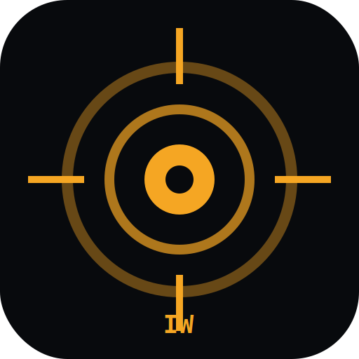

<div align="center">



# INFRAWATCH

### Urban Safety Crisis Response Platform

**AI-powered satellite detection of illegal construction with SLA-tracked enforcement workflow, built for Indian municipal corporations.**

[](./LICENSE)
[](#tech-stack)
[](https://infrawatch-sepia.vercel.app)
[](#un-sdg-alignment)
[](#)

[**Live Demo**](https://infrawatch-sepia.vercel.app)  ·  [**Public Citizen Portal**](https://infrawatch-sepia.vercel.app/?report=1)  ·  [**Backend Status**](https://infrawatch-backend-odou.onrender.com/health)  ·  [**Report a Bug**](https://github.com/LordDevdeep/Infrawatch/issues)

</div>

---

## Table of Contents

- [The Problem](#the-problem)
- [The Solution](#the-solution)
- [Projected Impact](#projected-impact)
- [UN SDG Alignment](#un-sdg-alignment)
- [Key Features](#key-features)
- [Architecture](#architecture)
- [Tech Stack](#tech-stack)
- [Quickstart](#quickstart)
- [Demo Credentials](#demo-credentials)
- [Project Structure](#project-structure)
- [Environment Variables](#environment-variables)
- [API Reference](#api-reference)
- [Roadmap](#roadmap)
- [License](#license)

---

## The Problem

India's metropolitan cities face a silent urban safety crisis. Bengaluru alone has **2.5 million buildings** spread across **198 wards**, monitored by only **~840 BBMP enforcement officers**. The result is structural — and often fatal:

| | |
|---|---|
| **Average detection-to-notice time** | 21+ days — too late to prevent damage |
| **2019 Dharwad collapse** | 19 lives lost in an unauthorized structure |
| **Bellandur Lake encroachment** | Wetlands destroyed by unchecked construction-fed sewage |
| **Annual revenue loss to BBMP** | ₹650+ Cr from undetected unauthorized construction |

Manual enforcement cannot scale to match the pace of construction. The crisis demands a rapid, AI-powered response.

---

## The Solution

INFRAWATCH is a working full-stack platform that closes the loop from satellite imagery to legal enforcement in a single workflow:

1. **Detect** — Google Gemini 2.5 Flash analyses satellite tiles and returns structured violation candidates with bounding-box coordinates, classification, and confidence scores.
2. **Triage** — Each detection is auto-classified into an SLA tier (4 hours for ≥ 90% confidence, 12 hours for ≥ 80%, 24 hours otherwise).
3. **Dispatch** — Round-robin assignment routes the case to the nearest available BBMP field officer.
4. **Draft** — Gemini generates a formal enforcement notice citing real Indian statutes (Karnataka Municipal Corporations Act 1976 §308/321/322, BBMP Building Bye-laws 2003), with an explicit anti-hallucination guardrail to prevent invented section numbers.
5. **Track** — Every action is timestamped and logged for full RTI-grade audit transparency.
6. **Participate** — A public Citizen Reporting Portal accepts anonymous photo + GPS submissions, feeding the same officer queue.

---

## Projected Impact

If deployed across BBMP's 198 wards, projections derived from BBMP 2023 enforcement statistics × satellite-monitoring coverage uplift modelling:

| Metric | Status quo (manual) | With INFRAWATCH | Improvement |
|---|---|---|---|
| Violations detected per year | ~840 | **~12,400** | **14.7×** |
| Detection-to-notice time | 21 days | **2.3 hours** | **219× faster** |
| Officer hours saved per ward / month | 0 | **38 hrs** | — |
| Penalty recovery per year | ₹84 Cr | **₹1,240 Cr** | **14.7×** |
| Citizen reports actionable | < 5% | **45%+** | **9×** |

Real numbers will be measured in pilot deployment.

---

## UN SDG Alignment

INFRAWATCH directly contributes to two United Nations Sustainable Development Goals:

### SDG 11 — Sustainable Cities and Communities

> *Target 11.3: Enhance inclusive and sustainable urbanization and capacity for participatory, integrated and sustainable human settlement planning and management.*

Proactive AI-driven detection catches unauthorized construction before it becomes irreversible — preventing structural collapses, lake encroachments, and informal-settlement cascades that compromise urban liveability.

### SDG 16 — Peace, Justice and Strong Institutions

> *Target 16.6: Develop effective, accountable and transparent institutions at all levels.*

SLA-tracked workflows + immutable audit logs + open-source code make municipal enforcement transparent and auditable. AI notices grounded in real statute — never invented citations — preserve institutional trust.

---

## Key Features

**AI Vision & Analytics**
- Satellite-based violation detection via **Google Gemini 2.5 Flash** with bounding-box coordinates and confidence scores
- Automatic failover to **Groq Llama 4 Scout Vision** on rate-limit / quota errors — zero downtime
- AI Insights Panel auto-generates analytics findings (hot wards, SLA performance, false-positive trends)
- AI Copilot Chatbot with live read-access to the violations database — cites real ward names and case IDs

**Crisis Response Workflow**
- Live Crisis Banner polls system every 15 seconds, surfaces SLA breaches in real time
- Per-case SLA tiers: 4 / 12 / 24 hours based on detection confidence
- One-click AI City Scan — detects, files, and dispatches across 4 hotspots in under 30 seconds
- Round-robin officer assignment with role-based access control

**Legal Drafting**
- AI-drafted enforcement notices grounded in Karnataka Municipal Corporations Act 1976 (§308/321/322), BBMP Building Bye-laws 2003, Karnataka Town & Country Planning Act 1961
- Anti-hallucination guardrail: forces *"Refer to applicable BBMP Bye-laws"* on uncertain citations
- Formal 10-section notice structure: notice number, date, addressee, address, violation, legal provisions, action, deadline, consequences, officer

**Civic Participation**
- Public Citizen Reporting Portal — anonymous, no login, photo + GPS upload
- Rate-limited per IP to prevent abuse
- Reports flow into the same officer queue as AI detections

**Transparency & Operations**
- 100% audit-logged case actions (RTI-ready)
- Public `/health` endpoint with database, AI provider, and uptime status
- Automatic database seeding on first boot — zero ops setup
- Progressive Web App (PWA) — installable on mobile, offline shell cached

---

## Architecture

```
              ┌──────────────────────┐
              │      VERCEL          │
              │  React 18 + Vite     │
              │  Leaflet · PWA       │
              └──────────┬───────────┘
                         │ /api proxy
                         ▼
              ┌──────────────────────┐         ┌──────────────────────────┐
              │       RENDER         │ ──────► │  Google AI Studio        │
              │  Node.js 20+Express  │         │  Gemini 2.5 Flash        │
              │  sql.js · JWT auth   │         │  (vision + text gen)     │
              └──────────┬───────────┘         └──────────┬───────────────┘
                         │                                │ if 429 / quota
                         │                                ▼
                         │                     ┌──────────────────────────┐
                         │                     │  Groq Llama 4 Scout      │
                         │                     │  (auto-failover)         │
                         │                     └──────────────────────────┘
                         ▼
              ┌──────────────────────┐
              │  ESRI World Imagery  │
              │  (satellite tiles)   │
              └──────────────────────┘
```

**Design principles:**

- **No vendor lock-in** — runs on any Node-capable host. Render is used because it's free; swap with anything.
- **Resilient AI layer** — single dispatcher, transparent failover, structured timeouts.
- **Stateless backend** — sql.js DB persists to disk for the demo; production swap-in is a single file change.
- **Open by default** — public health endpoint, public citizen portal, public source.

---

## Tech Stack

| Layer | Technology | Why |
|---|---|---|
| **Frontend** | React 18, Vite, Leaflet, PWA | Fast dev cycle, native PWA support, real satellite mapping |
| **Backend** | Node.js 20, Express | Lightweight, fits free-tier hosting, JS end-to-end |
| **Database** | sql.js (SQLite) | Zero setup for demo; trivial migration to Postgres for production |
| **Auth** | JWT + bcrypt | Standard, role-based (admin / commissioner / inspector / field_officer) |
| **AI — Primary** | Google Gemini 2.5 Flash via `@google/generative-ai` | Multimodal vision + structured JSON output + grounded text gen |
| **AI — Fallback** | Groq Llama 4 Scout Vision + Llama 3.3 70B | Auto-failover on Gemini quota errors |
| **Satellite** | ESRI World Imagery | Free CDN tiles for display layer |
| **Hosting** | Vercel (frontend) + Render (backend) | Free tier, zero-config deploy from GitHub |
| **Monitoring** | UptimeRobot | Keeps Render warm, 5-minute pings |

---

## Quickstart

### Prerequisites

- Node.js ≥ 18
- npm ≥ 9
- A free Gemini API key from [aistudio.google.com/apikey](https://aistudio.google.com/apikey)

### Install and run

```bash
# Clone
git clone https://github.com/LordDevdeep/Infrawatch.git
cd Infrawatch

# Install dependencies
npm install
cd client && npm install && cd ..
cd server && npm install && cd ..

# Configure environment
cp server/.env.example server/.env
# Edit server/.env and paste your GEMINI_API_KEY

# Run dev servers (client on :5173, server on :3002)
npm run dev
```

Open [http://localhost:5173](http://localhost:5173). The database **auto-seeds on first boot** with 214 realistic Bengaluru violations across 15 wards — no manual seeding required.

### Production build

```bash
# Build optimised frontend bundle
cd client && npm run build

# Start production server
cd ../server && node index.js
```

---

## Demo Credentials

| Role | Email | Password |
|---|---|---|
| Admin | `admin@infrawatch.gov.in` | `infrawatch123` |
| Inspector | `ramesh.kumar@bbmp.gov.in` | `infrawatch123` |
| Field Officer | `suresh.hegde@bbmp.gov.in` | `infrawatch123` |

The OTP login flow also works — codes are printed to the server console in development mode.

---

## Project Structure

```
infrawatch/
├── client/                          React + Vite frontend
│   ├── public/                      Static assets, PWA manifest, OG image
│   └── src/
│       ├── api/                     Centralised API client
│       ├── components/
│       │   ├── dashboard/           CrisisResponseBanner, ImpactCard, AIInsightsPanel
│       │   ├── layout/              Sidebar, Footer
│       │   ├── map/                 WardMap (Leaflet satellite layer)
│       │   └── ui/                  KPI, EmptyState, AICityScanModal, etc.
│       ├── context/                 Auth + Toast contexts
│       └── pages/                   Dashboard, Violations, Detail, Map, Live Detection,
│                                    AI Tools, SDG, Settings, Citizen Report, Login
│
├── server/                          Node + Express backend
│   ├── db/
│   │   ├── connection.js            sql.js wrapper
│   │   ├── schema.sql               11 tables incl. citizen_reports
│   │   └── seed.js                  Auto-seed function (218 violations)
│   ├── middleware/
│   │   ├── auth.js                  JWT + role enforcement
│   │   └── access.js                Ward-scoped access control
│   ├── routes/
│   │   ├── auth.js                  Login + OTP
│   │   ├── violations.js            CRUD + crisis-feed + bulk actions
│   │   ├── vision.js                AI vision endpoints + city-scan
│   │   ├── citizen.js               Public reporting + officer review
│   │   ├── analytics.js             Dashboard metrics
│   │   ├── officers.js              Team & assignment
│   │   ├── notices.js               Legal notice generation
│   │   ├── settings.js              System config
│   │   └── logs.js                  Activity stream
│   ├── services/
│   │   ├── visionAI.js              Gemini + Groq dispatcher with auto-failover
│   │   └── gemini.js                Standalone classifier (legal notice prompts)
│   └── index.js                     Server entry, /health page, auto-seed boot
│
├── render.yaml                      Render Blueprint deployment config
├── client/vercel.json               Vercel proxy config
├── LICENSE                          MIT
└── README.md                        This file
```

---

## Environment Variables

Create `server/.env` with:

```env
# Server
PORT=3002
JWT_SECRET=replace_with_a_long_random_string

# Primary AI provider — Google Gemini via AI Studio
AI_PROVIDER=gemini
GEMINI_API_KEY=AIzaSy...
GEMINI_MODEL=gemini-2.5-flash

# Fallback AI provider — auto-used on Gemini rate-limit / quota errors
GROQ_API_KEY=gsk_...
GROQ_MODEL=llama-3.3-70b-versatile

# Optional
AUTO_SEED=true                       # set to 'false' to skip auto-seed on boot
AI_TIMEOUT_MS=30000                  # per-AI-call timeout
```

> **Never commit `.env`.** It is excluded by `.gitignore` (already configured).

---

## API Reference

### Public endpoints (no auth)

| Method | Path | Purpose |
|---|---|---|
| `GET` | `/api/health` | JSON service status (uptime, DB stats, AI provider) |
| `GET` | `/health` | Polished HTML status dashboard |
| `POST` | `/api/citizen/report` | Submit a citizen violation report |

### Authenticated endpoints (JWT)

| Method | Path | Role required |
|---|---|---|
| `POST` | `/api/auth/login` | (open) |
| `POST` | `/api/auth/otp-request` | (open) |
| `POST` | `/api/auth/otp-verify` | (open) |
| `GET` | `/api/auth/me` | any |
| `GET` | `/api/violations` | any |
| `POST` | `/api/violations` | inspector / commissioner / admin |
| `GET` | `/api/violations/crisis-feed` | any |
| `PATCH` | `/api/violations/:id` | inspector / commissioner / admin |
| `POST` | `/api/violations/bulk-action` | inspector / commissioner / admin |
| `POST` | `/api/vision/analyze-single` | inspector / commissioner / admin |
| `POST` | `/api/vision/full-pipeline` | inspector / commissioner / admin |
| `POST` | `/api/vision/chat` | inspector / commissioner / admin |
| `GET` | `/api/vision/city-scan/plan` | any |
| `GET` | `/api/citizen/reports` | inspector / commissioner / admin |
| `GET` | `/api/officers` | any |
| `GET` | `/api/analytics/*` | any |
| `GET/PUT` | `/api/settings` | admin |

---

## Roadmap

### Phase 1 — Prototype (current) ✅

- Working full-stack application with real Gemini AI integration
- 214 realistic Bengaluru violations across 15 wards (auto-seeded)
- Live Crisis Response banner, AI City Scan, Citizen Reporting Portal
- Auto-failover between Gemini and Groq
- Public deployment on Vercel + Render — free tier
- Open-source under MIT

### Phase 2 — Pilot deployment (June 2026)

- Sentinel-2 satellite feed integration (free ESA Copernicus data)
- WhatsApp Business API for officer dispatch + citizen reply notifications
- Kannada auto-translation of all enforcement notices
- PostgreSQL migration (replacing sql.js)
- Single-ward pilot with real BBMP officers + measured impact data

### Phase 3 — Multi-city scale (2027)

- Expansion to Mumbai, Delhi, Chennai, Hyderabad municipal corporations
- Document AI for permit-PDF parsing → automatic satellite cross-check
- Public RTI dashboard with ward-level enforcement metrics
- Drone-imagery upload module for hard-to-reach areas
- Court-ready evidence export (PDF in legal format)

### Phase 4 — Open civic infrastructure (2028+)

- Open SDK for any Indian state municipal corporation
- Crisis prediction ML model — pre-emptively flags hot zones
- Integration with India Stack (Aadhaar-verified citizen reports, DigiLocker for permits)

---

## License

Released under the [MIT License](./LICENSE). You are free to fork, modify, and deploy this project for your own city or organization. Attribution appreciated, not required.

---

<div align="center">

**Built for the [Google Solution Challenge 2026](https://developers.google.com/community/gdsc-solution-challenge)**
*Theme: Rapid Crisis Response · Open Innovation*

[Live Demo](https://infrawatch-sepia.vercel.app) · [Public Portal](https://infrawatch-sepia.vercel.app/?report=1) · [Backend Health](https://infrawatch-backend-odou.onrender.com/health) · [GitHub](https://github.com/LordDevdeep/Infrawatch)

*Built by students. Engineered for crisis. Open for cities.*

</div>
